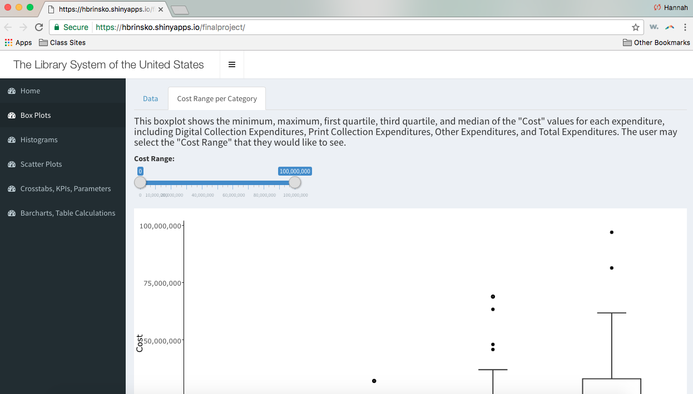
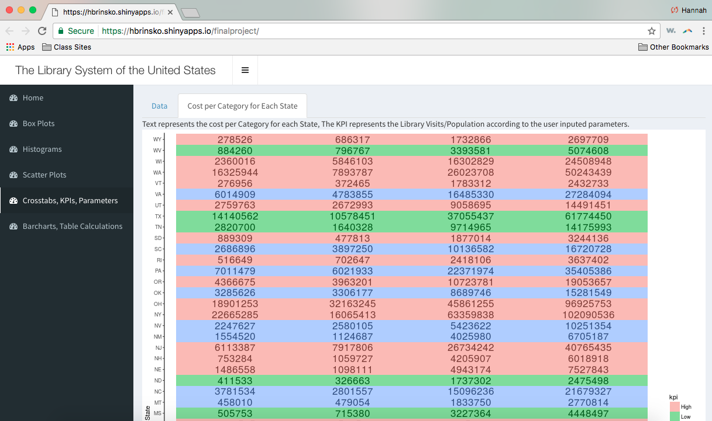

## Session Information
<a href="#top">Back To Top</a>

```{r sessionInfo}
sessionInfo(package=NULL)
```

## Important Resources and Links
<a href="#top">Back To Top</a>

To see our GitHub repository, click [here](https://github.com/CannataUTDV/s17dvfinalproject-folkes-moor-brinsko-pappas).

To see our Shiny application, click [here](https://hbrinsko.shinyapps.io/finalproject).

## Summary of Library Data
<a href="#top">Back To Top</a>

This data set is from kaggle. You can find this data [here](https://www.kaggle.com/imls/public-libraries). It provides detailed information about libraries in each state in the United States.

```{r states}
summary(states)
```

## Summary of Subsets of Library Data
<a href="#top">Back To Top</a>

This data is a subset of the library data that was re-configured to make Digital Cost, Other Cost, Print Cost, and Total Cost to be a subset of a larger category -- Collection Cost Type. This way, the data could be easily grouped on the same visualization.

```{r states_boxplot}
summary(states_boxplot)
```

This data is a subset of the library data that was re-configured to make Children's Programs, Young Adult Programs, and Adult Programs to be a subset of a larger category -- Program Type. This way, the data could be easily grouped on the same visualization.

```{r Program_Category}
summary(Program_Category)
```

## Summary of Census Data
<a href="#top">Back To Top</a>

This data set is from the census data on data.world. You can find this data [here](https://data.world/uscensusbureau/acs-2015-5-e-employmentstatus/file/USA_All_States.csv). It provides the number of employed persons in each state.

```{r census_employment}
summary(census_employment)
```

This data set is from the census data on data.world. You can find this data [here](https://data.world/uscensusbureau/acs-2015-5-e-schoolenrollment/file/USA_All_States.csv). It provides the number of people enrolled in high school in each state.

```{r census_enrollment}
summary(census_enrollment)
```

This data set is from the census data on data.world. You can find this data [here](https://data.world/uscensusbureau/acs-2015-5-e-income/USA_All_States.csv). It provides the median family income in each state.

```{r Median_Family_Income}
summary(Median_Family_Income)
```

This data set is from Current Results. You can find this data [here](https://www.currentresults.com/Weather/US/average-annual-state-temperatures.php). It provides the average temperature in each state.

```{r State_Temp_and_Rain}
summary(State_Temp_and_Rain)
```

This data set is from Researcher Tools. You can find this data [here](http://researchertools.blogspot.com/2012/09/excel-file-with-us-states-abbreviations.html). It provides useful connections between state names, state codes, and regions. 

```{r states_with_regions}
summary(states_with_regions)
```

## The Tableau Visualizations
<a href="#top">Back To Top</a>

This is a map of the United States, color-coded by region. This is <i>not</i> one of our visualizations. It simply shows the regions used in the following two visualizations.   


## The Shiny Visualizations
<a href="#top">Back To Top</a>







